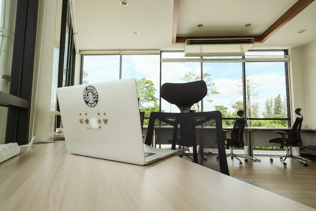
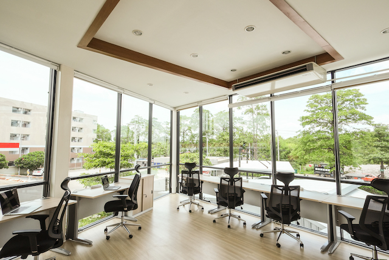

## We Are Hiring !

[AGENT ONE](https://www.agentone.co.th) is a STARTUP company dancing towards AMBITIOUS goals of creating an INNOVATIVE platform for selling TRENDY products.

We are supported by EXPERIENCED and KIND PROFESSIONALS that lead us to the right direction, guide us to avoid big obstacles, and give us hands if we fall into some holes.

We are NOT DREAMING and NOT PLAYING WITH PASSION; We have CLEAR VISION.

 **We "STAY FOCUSED" – "WORK HARD (but FLEXIBLE)" – "HAVE FUN" and "PAY REASONABLY FOR THE VALUE YOU GIVE TO US"**

Join us and SUCCESS with us. We promise you will not regret it!

If you are interested, please submit your RESUME to recruit@agentone.co.th

## เข้าร่วมทีมกับเรา !

เรากำลังตามหาเพื่อนร่วมทีมไฟแรง ในตำแหน่ง Full Stack JavaScript Developer และ UI & UX Designer

หากคุณมีความสนใจ อยากเป็นส่วนหนึ่งของสุดยอดบริษัทในอนาคต โปรดส่ง RESUME มาที่ recruit@agentone.co.th

## Position

### Full Stack JavaScript Developer

พัฒนา Responsive Web Application ทั้งในส่วน Frontend และ Backend ด้วย JavaScript, HTML, CSS

คุณสมบัติ:

* จบการศึกษาระดับปริญญาตรี
* มีประสบการณ์พัฒนา หรือเข้าใจหลักการของ Express.js และ Angular.js _(Advantage)_
* มีพื้นฐานในการใช้งาน Git Version Control
* มีพื้นฐานในการใช้งาน Linux Server

### UI & UX Designer

ออกแบบ UI และ UX สำหรับ Website, Web Application, และ Mobile Application

คุณสมบัติ:

* จบการศึกษาระดับปริญญาตรี
* มีประสบการณ์ในการทำงานด้าน UI & UX 1 ปีขึ้นไป
* เชี่ยวชาญเครื่องมือ Adobe Creative Suite, Sketch 3, InVision หรืออื่นๆ ที่เทียบเท่า
* สามารถใช้  macOS _(Advantage)_
* สามารถวาดรูป ทำ Wireframe ออกแบบ Character และเขียน Storyboard _(Advantage)_

## Benefit +

* ขนม และน้ำดื่มฟรี
* สนับสนุนการพัฒนาตนเอง เช่นส่งไปสัมมนา หรือเข้าคอร์สเทรนนิ่งที่สนใจ

## Location

### Development Center  Agent One Co., Ltd.

1, Soi Praditmanutham 25, Praditmanutham Road

### สำนักงานพัฒนาระบบ บริษัท เอเจนท์ วัน จำกัด

เลขที่ 1 ปากซอยประดิษฐ์มนูธรรม 25 (ใกล้ เซ็นทรัลเฟสติวัล อีสต์วิลล์)

_Search Google Map for (13.821486, 100.625615)_

## Interested ?

มีคำถาม ข้อสงสัย หรือสนใจเข้าร่วม โปรดติดต่อได้ที่อีเมล  recruit@agentone.co.th หรือที่โทรศัพท์ +66 (0) 2578 0619
